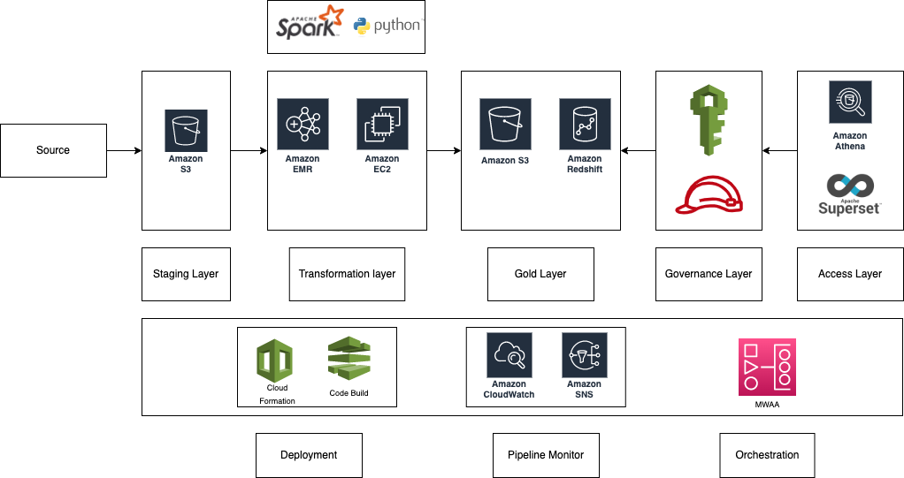

# Sample module
* data pipline - daily_generate_transaction_report
 * This is the sample pipeline to demonstrate how the flow of the data will happen in the pipeline.
 * Python module is packaged in a wheel file which is deployed in s3
 * Input Data and Output Data is stored in s3(for now ir is reading from bin folder)

I have used airflow to orchestrate the data pipeline. Airflow is a platform to programmatically author, schedule and monitor workflows.
spark is used for all the transformations in the pipeline

# Command to run the pipeline
```
spark-submit ./daily_generate_transaction_report/transaction_report/main.py --inputDataPathPrefix ./bin/transaction_metrics/data/transaction_data --outputDataPathPrefix ./bin/transaction_metrics/data/output/metric_calculateion/ --processDate 2021-01-23
```

# DAG deplyment
* airflow dag is used to orchestrate the PySpark Job

# Pipline Design
