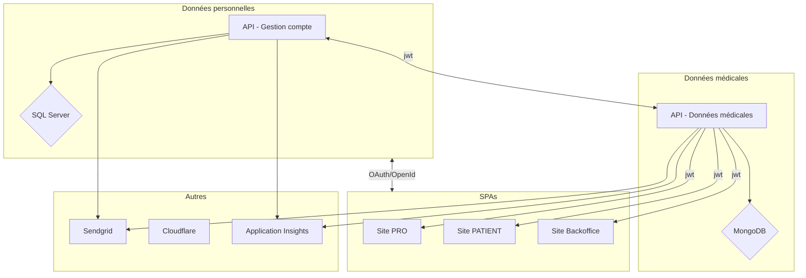

# Test technique devops

Ce test a pour but de servir de base à la discussion avec l'équipe technique pour les candidats à un poste Devops
C'est une opportunité pour l'équipe tech de Digikare de voir comment vous déployez une architecture et organisez un projet.

## Livrables

Le livrable attendus est un projet et une stratégie permettant de déployer un environnement complet tous les soirs dédié au recettage en cours de sprint des fonctionnalités ajoutées à la plateforme Orthense. Cet environnement est appelé Environnement de Nightly.
Le projet n'a pas besoin d'être 100% fonctionnel mais doit permettre de mettre en lumière votre stratégie et vos principes d'implémentation d'une telle architecture.

## Architecture de la solution

L'architecture de la solution en place est la suivante :

## Stack technique

Dans le cadre de cet exercice vous utiliserez Terraform/Ansible pour décrire et déployer les ressources et l'infrastructure.
Le cloud provider cible est Azure.

## Objectif

Décrire comment vous concevriez le déploiement d'un tel environnement. Une attention particulière sera donnée sur la gestion des configurations/secrets, la modularité, l'automatisation et la destruction de cet environnement éphémère.

## Session de revue

Lors de l'entretien technique avec l'équipe, vous présenterez votre solution permettant de répondre à la problématique ciblée ici, à savoir le déploiement d'un environnement de recettage "nightly".

## Glossaire

Environnement de recettage nightly: environnement dédié permettant le recettage fonctionnel des US livrées par les équipes de developpement. Cet environnement bénéficie de jeux de données spécifiques permettant d'évoluer dans un environnement maitrisé.
