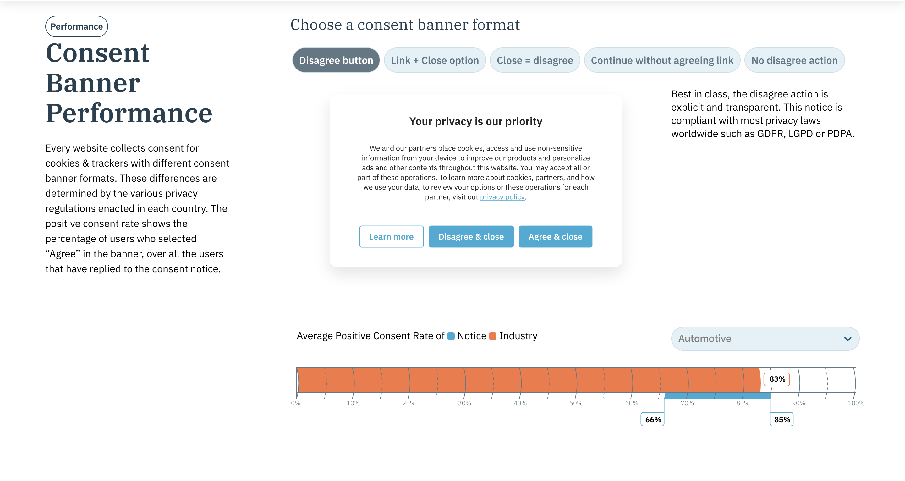

# **Front-end web developer challenge**

This challenge is used by Didomi for evaluating candidates for front-end web development positions.

This challenge is a chance for engineers at Didomi to see how you code and organize a project to implement a specification.

**Deliverables**

The expected deliverable is a fully functional website module that includes the following:

* Code of the module using databases
* Presentation of the module
* Documentation for launching the development 

**Technical stack**

The application should use one of the following stacks:

* React with a Material library
* Except for these requirements, feel free to use whichever libraries, frameworks or tools you deem necessary.

**Expectations**

Your code will be reviewed by multiple engineers at Didomi and will serve as the base for a discussion in interviews.

We want to see how you approach working on a complete project and strongly recommend that you work on this challenge alone. We will particularly focus on your attention to details and expect the code to be professionally structured, commented, documented, and tested.

If anything is unclear, feel free to ask any question that might help you understand the specifications or requirements better.

**Delivery**

Your application can be sent to us as a GitHub repository (in which case you are welcome to fork this repository) or as a compressed archive containing all the deliverables.

**The challenge**

Companies need to collect consent from consumers before using their data. For instance, website visitors might need to explicitly consent to receive email newsletters through a form before a company can send emails to those visitors.

At Didomi, we have the [Data Privacy Barometer](https://privacy-barometer.didomi.io/en) as one of our websites that enables the possibility to educate, engage and empower the visitor with a knowledge bank consisting of:

* A look at the evolution of privacy and data regulations around the world over the past decade
* Information about specific countries and their stance on data privacy laws
* Exclusive insights on data collection practices per industries and purposes
* Performance of the cookie consent notices you can implement with a CMP

In the most actionable module, we can check the different consent banner formats (depending on the country/legislation needs) and the average positive consent per industry. \

Here you have the module:

The goal of this challenge is to, using the images and JSON databases attached, recreate and improve this existing module.

The objective is to:

* Rebuild the filters with the format of banners (svg files).
* Add a second module with the country filter since each country has its regulation and their specific banner needs (`countries` JSON file). The data in the JSON will allow you to display the list of countries.

Do not worry too much about the copywriting, you can use the same title and texts. However, you are free to reorganize the page layout the way you want.

You can create the filter by country component at the bottom the way you want, with a UI library or from scratch. You have full freedom to add more charts or any text, add design elements you think might make sense to improve the existing page.

**Review session**

After receiving your code challenge, we organize a review session with you and a few engineers from Didomi. During the review session, we will:

* Ask you to share your screen and do a quick demo of the module you built
* Ask you to present your project structure and walk us through the code (the different components, the state management, etc.)
* Ask you general technical questions related to your project and frontend architecture

A few examples of the topic that we like to discuss in more details:

* UI libraries
* State management
* Styling
* Testing