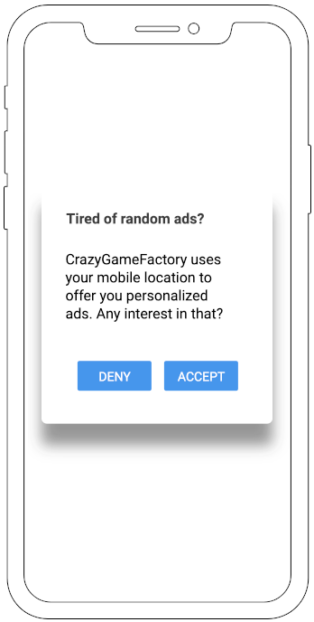

This challenge is used by Didomi for evaluating candidates for mobile development positions.

# Rules of the game
This challenge is a chance for engineers at Didomi to see how you code and organize a project to implement a specification.

## Deliverables
The expected deliverable is a fully functional project that includes the following:

- Code of the library
- Tests of the library
- Documentation for launching a development environment and running the library
- An app that embeds the library so that we can test it
 
## Technical stack
Feel free to use whichever third-party libraries, frameworks or tools you deem necessary. Keep in mind that the library is intended to be included into apps so size should be kept to a reasonable minimum.

## Expectations
Your code will be reviewed by multiple engineers at Didomi and will serve as the base for a discussion in interviews.  
We want to see how you approach working on a complete project and strongly recommend that you work on this challenge alone. We will particularly focus on your attention to details and expect the code to be professionally structured, commented, documented, and tested.

If anything is unclear, feel free to ask any question that might help you understand the specifications or requirements better.

## Delivery
Your application can be sent to us as a GitHub repository (in which case you are welcome to fork this repository) or as a compressed archive containing all the deliverables. 

# The challenge
In some specific cases, companies need to collect consent from consumers before using their data. For instance, app users might need to explicitly consent to share their geolocation before a company can use it for advertising.

The goal of this challenge is to build a very simple library that can be embedded in a mobile app to collect the user consent. It's not very user-friendly but it's good enough for this challenge.

## Product specification
The library should be built either in Java (Android library) or Swift (iOS framework) to be embedded into native applications. The library should be able to do three things:  
 - Expose an API to the host application to read and write the consent status programmatically
 - Display a view to collect consent as needed
 - Send an HTTP request to a backend API when the user has made a choice

### Workflow
The library's job is to show a view to collect the user consent. The library should store the user consent status in the local storage (`SharedPreferences` or `NSUserDefaults`). The user can have 3 consent status: `undefined` (nothing stored in the local storage), `deny` (user has denied consent), or `accept` (user has given consent).

When the app gets launched and the library is initialized, the library should check if the user has already given consent. If there is no consent status in the local storage, the library should display a view to collect consent from the user. If the user has already given consent previously, the library should not display the view.

### API
The library should expose (at least) the following methods to the host application:
 - `getConsentStatus()`: Return the current consent status of the user
 - `setConsentStatus(consentStatus)`: Set the consent status of the user

Feel free to add other methods that could be required for interacting with the library and setting up the view.

### View
If the user has not made a choice yet, show a dialog with two options: Deny and Accept. Hide the dialog after the user makes a choice.



This is only a wireframe that does not need to be matched perfectly. Use the native components for the dialog, texts, buttons, etc.  

### HTTP request
When the user makes a choice, send an HTTP POST request to http://www.mocky.io/v2/5e14e8122d00002b00167430. Include a JSON-encoded body with the following fields:
 - `status`: `deny` if the user clicked on "Deny" or `accept` if the user clicked on `Accept`
 - `device_id`: device advertising ID (AdID on Android or IDFA on iOS)
 - `date`: ISO-8601 UTC date when consent was collected

Example of JSON body:
```json
{
    "status": "accept",
    "device_id": "e54ee786-7520-4bc2-8c66-a34d42f2340e",
    "date": "2020-01-07T20:24:31Z"
}
```