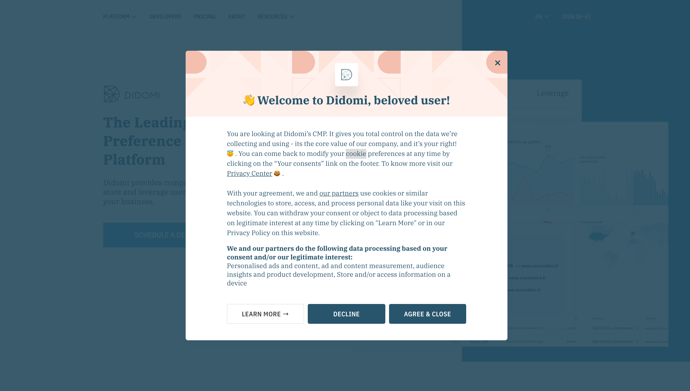

# QA engineering challenge

This challenge is used by Didomi for evaluating candidates for QA engineering positions.

This challenge is a chance for engineers at Didomi to see how you code and organize a project to implement a specification.

## Rules of the game

### Deliverables

The expected deliverables are:

- A project that runs an automated test suite
- A presentation on designing and implementing an E2E testing strategy

### Expectations

Your code will be reviewed by multiple engineers at Didomi and will serve as the base for a discussion in interviews.  
We want to see how you approach working on a complete project and strongly recommend that you work on this challenge alone. We will particularly focus on your attention to details and expect the code to be professionally structured, commented, and documented.

If anything is unclear, feel free to ask any question that might help you understand the specifications or requirements better.

### Delivery

Your project can be sent to us as a GitHub repository (in which case you are welcome to fork this repository) or as a compressed archive containing all the deliverables.

## The challenge

The challenge is composed of two parts.

### Part 1 - Automated tests of a consent notice

Part of Didomi's job is to manage consent notices on websites. Here is an example of a consent notice on the Didomi website:

As those notices are a key part of websites and their operations (for advertising, analytics, etc.), we need to make sure that they are always up and running as expected.

Create an automate test suite that validates the correct behavior of the notice:

- Go to <https://www.didomi.io/>
- Validate that the notice is present
- Give consent by clicking on "Agree and Close"
- Validate that the notice gets closed
- Validate that an HTTP POST request is sent to `https://api.privacy-center.org/v1/events` with `type = consent.given`
- Validate that the function `Didomi.getUserStatus()` (<https://developers.didomi.io/cmp/web-sdk/reference/api#getuserstatus>) responds with the correct values

#### Technical stack

The test library should use the following technologies:

- JavaScript or TypeScript
- Gherkin for defining scenarios
- CucumberJS and Cypress for running the tests

Except for these requirements, feel free to use whichever libraries, frameworks or tools you deem necessary.

### Part 2 - Test strategy

The consent notices product is made of multiple parts:

- SDKs (Web and Mobile) that are deployed on websites and mobile apps to show consent notices
- APIs that provide configuration to the SDKs and store events collected by the SDKs
- Administration portal ("Didomi Console") used to configure the SDKs through the APIs

In this part, we expect you to present how you would design and execute the entire testing strategy for the consent notices product. The strategy should include:

- How you would manage a database of tests that grows with new features
- What tests would be run manually vs automatically
- How the work of creating and automating test cases would be distributed between product managers, engineers, etc.
- How every component that is part of the product (backend, frontend, SDKs) would be tested and you would test the whole chain

From a user perspective, you can focus on designing a testing strategy for the most common scenario, which is the following:

- Log into the administration portal
- Create or modify a consent notice
- Publish the changes
- Check that the changes are correctly propagated to your website or mobile app
