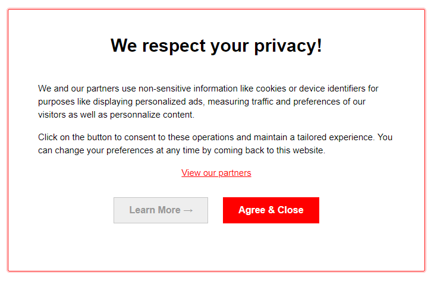

# README

This challenge is used by Didomi for evaluating candidates for technical consultant positions.

As a technical consultant, you will work closely with Didomi’s clients throughout the sales and implementation processes. You will guide them through the Didomi platform and the correct integration paths for their existing applications.

# The challenge

The goal of this challenge is to walk you through the different stages of integrating the Didomi platform and give you a chance to see how our clients do it every day.
Throughout this challenge, the [Didomi documentation](https://developers.didomi.io/) will help you understand how to configure and deploy our platform.

This challenge is composed of 3 steps:

1. Create a consent notice
2. Validate a CMP deployment
3. Use our API to manage user consents

## Step 1 - Create a consent notice

One of the key requirements of GDPR is that user consent is needed before personal data is used for any purpose like targeted advertising, personalization, analytics, etc. One of the tools that Didomi offers to comply with this requirement is “consent notices”.

A consent notice asks the user for consent to a set of purposes (what will the collected personal data be used for) and vendors (who will collect personal data). It can be a small banner at the top or bottom of a website or mobile app, a full screen popup, etc.

Using the [Getting Started](https://developers.didomi.io/cmp/web-sdk/getting-started) section of the Didomi documentation, create an HTML page that displays a consent notice to collect consent from the user.
Below is the script tag you can use in the HTML page to load our SDK:

```html
<script type="text/javascript">window.gdprAppliesGlobally=true;(function(){function a(e){if(!window.frames[e]){if(document.body&&document.body.firstChild){var t=document.body;var n=document.createElement("iframe");n.style.display="none";n.name=e;n.title=e;t.insertBefore(n,t.firstChild)}
else{setTimeout(function(){a(e)},5)}}}function e(n,r,o,c,s){function e(e,t,n,a){if(typeof n!=="function"){return}if(!window[r]){window[r]=[]}var i=false;if(s){i=s(e,t,n)}if(!i){window[r].push({command:e,parameter:t,callback:n,version:a})}}e.stub=true;function t(a){if(!window[n]||window[n].stub!==true){return}if(!a.data){return}
var i=typeof a.data==="string";var e;try{e=i?JSON.parse(a.data):a.data}catch(t){return}if(e[o]){var r=e[o];window[n](r.command,r.parameter,function(e,t){var n={};n[c]={returnValue:e,success:t,callId:r.callId};a.source.postMessage(i?JSON.stringify(n):n,"*")},r.version)}}
if(typeof window[n]!=="function"){window[n]=e;if(window.addEventListener){window.addEventListener("message",t,false)}else{window.attachEvent("onmessage",t)}}}e("__tcfapi","__tcfapiBuffer","__tcfapiCall","__tcfapiReturn");a("__tcfapiLocator");(function(e){
  var t=document.createElement("script");t.id="spcloader";t.type="text/javascript";t.async=true;t.src="https://sdk.privacy-center.org/"+e+"/loader.js?target="+document.location.hostname;t.charset="utf-8";var n=document.getElementsByTagName("script")[0];n.parentNode.insertBefore(t,n)})("ba9770df-ec85-4d9c-ad49-35c42c327fc4")})();</script>
```

We expect the consent notice to have the following properties:

### Notice Configuration

- Be a popup that blocks access to the page until consent has been given/denied
- Use red as its main theme color
- Collect consent for all IAB vendors, Google, and one custom vendor
- Allow French and English as languages with English as the default language

### Notice Behavior

As an additional feature, ensure that consent is collected when the user scrolls more than 30% of the page.
Note that there is no configuration option to enable this, so it has to be coded in JavaScript with the [Didomi SDK API](https://developers.didomi.io/cmp/web-sdk/reference/api).

Here is what the result should look like:



### Deliverable

Your HTML file should be sent to us as the deliverable. Comments in the HTML are welcome.

## Step 2 - Validate a CMP deployment

Our clients usually configure their CMP through the Didomi Console. Once their setup is done, Didomi often double-checks their configuration and confirm that the setup is correct.

If you were tasked with validating a CMP deployment for a client, how would you validate the following elements:

- The notice tag is correctly deployed
- The notice behaves as expected
- The following specific integrations are correctly configured: [Google DFP/Ad Manager](https://developers.didomi.io/cmp/web-sdk/consent-notice/vendors-and-purposes/google-dfp-adsense-adx), [Prebid](https://developers.didomi.io/cmp/web-sdk/consent-notice/vendors-and-purposes/prebid), [Google Tag Manager](https://developers.didomi.io/cmp/web-sdk/tags-management/google-tag-manager)

You can use the following website to run some of your tests: [Le Parisien](http://www.leparisien.fr/)

### Deliverable

We expect you to present your findings and thought process during one of your interviews. No written answer is expected for this step.
We understand that you might not be familiar with some tools listed (DFP, GTM, etc.), in which case you can ignore that part or do only one of them.

## Step 3 - Use our API to manage user consents

The Didomi platform exposes an API to manage user consents: [https://developers.didomi.io/api/guides/consents](https://developers.didomi.io/api/guides/consents)
The API allows clients to get the consent status of their users, as well as update it when they collect new consent.

Using the Didomi API, write a script that:

1. Creates 10 consent events for 10 different users with a positive consent for the purpose `cookies` and the vendor `google`
2. Gets the consent status for these 10 users as well as their Didomi ID and displays it
3. Updates the consent status for these 10 users to disable the purpose `cookies`

Your script can be written in any language that you are familiar with.

The following documentation sections should be useful:

- [Guide on Consents](https://developers.didomi.io/api/guides/consents)
- [Consent Events](https://developers.didomi.io/api/resources/consents/events) and [Consent Users](https://developers.didomi.io/api/resources/consents/users)
- [Authentication](https://developers.didomi.io/api/introduction/authentication)

### Deliverable

Your script should be sent to us as the deliverable. Comments in the code are welcome.