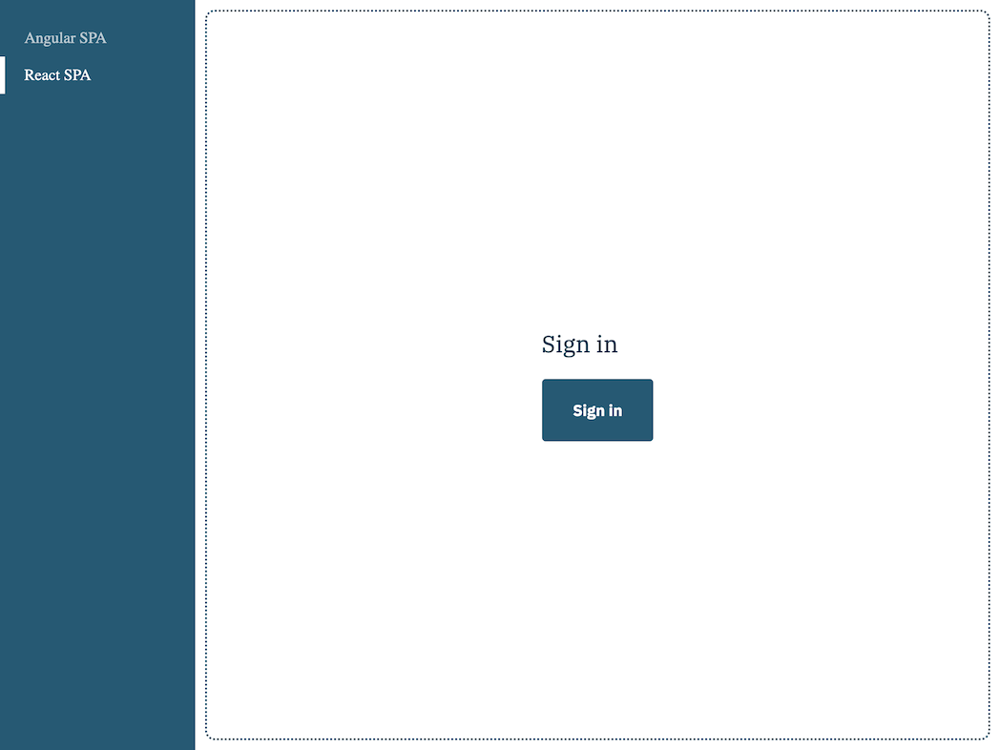
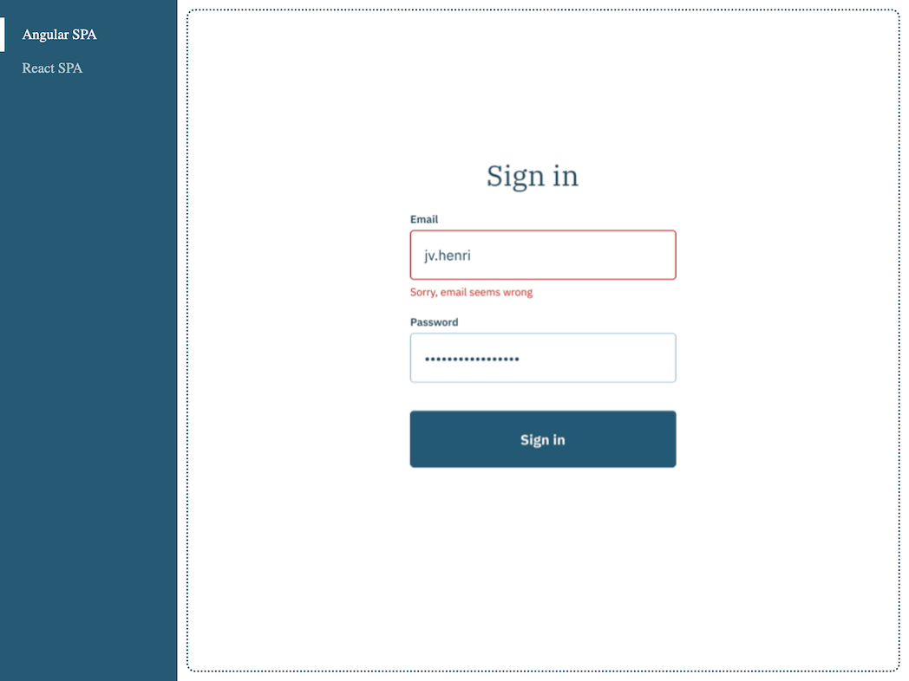

# Micro front-end engineering challenge

This challenge is used by Didomi for evaluating candidates for Micro front-end maintainer positions.

This challenge is a chance for engineers at Didomi to see how you code and organize a project to implement a specification.

## CodeBase overview

Please take a look at [GETTING_STARTED.md](GETTING_STARTED.md) for codebase overview and getting started guide.

## Challenge checklist

Design specification for the challenge - [Figma](https://www.figma.com/file/fYeI82SDeNBcDCOSgWDdfp/Micro-Front-End-Challenge?node-id=0%3A1);

The next items needs to be added to complete the challenge:

- Update `ui-button` component in the UI Library to support size and variant props (see design spec).
- Add `ui-input` component to the UI Library (see design spec). This should be generic input control that supports common text input attributes as props and change event as output. Additionally it needs to have label and error props.
- Add storybook's stories to the `ui-input` component.
- Add tests for `ui-button` and `ui-input` components.
- Use both components in `angular-spa` and `react-spa` to create `Sign In` UI according to the design.
You can display the submitted values in an alert dialog
- Add validation for `Sign In` form in `angular-spa` and `react-spa`:
  - Both fields are required.
  - Email must be a valid email format.
  - The error messages should only be displayed once the form is submitted or input is touched.
  Bonus point if you use a library for the form validation (eg Angular Forms module for Angular and Formik for React).
- Bonus point if you add unit tests for both angular-spa and react-spa `Sign In` pages.

Current UI:

Final Expected UI:

## Expectations

Your code will be reviewed by multiple engineers at Didomi and will serve as the base for a discussion in interviews.
We want to see how you approach working on a complete project and strongly recommend that you work on this challenge alone. We will particularly focus on your attention to details and expect the code to be professionally structured, commented, documented, and tested.

If anything is unclear, feel free to ask any question that might help you understand the specifications or requirements better.

## Delivery

Your application needs be sent to us as a GitHub repository or as a compressed archive containing all the deliverables.

## Review session

After receiving your code challenge, we organize a review session with you and a few engineers from Didomi. During the review session, we will:

- Ask you to share you screen and do a quick demo of the code you've added to the app
- Ask you general technical questions related to your project, components, tests and frontend architecture